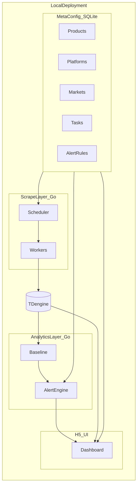

# Price Sniffer 产品说明书

跨电商平台价格与销量监控系统。面向需要在本地部署、跨平台运行的团队，通过模拟用户访问定期采集多平台商品数据，提供基准价比对、可配置告警与可视化看板。

---

## 1. 产品概述

### 1.1 定位

Price Sniffer 是一套**本地部署**的电商价格情报系统：指定产品关键字、电商平台与市场区域后，定期抓取该产品相关店铺（供应商）地址、定价、销售数量与销售额，写入时序库；分析层计算各维度基准价并按结构化规则告警；H5 管理台提供配置管理与趋势展示。

### 1.2 目标用户

- 品牌与渠道运营：监控各市场、各平台、各店铺的售价与销量变化
- 采购与供应链：比对供应商报价与市场成交价
- 独立站 / 跨境卖家：跟踪竞品在多站点的价格策略

### 1.3 核心价值

| 价值点 | 说明 |
|--------|------|
| 多平台统一视角 | 一次配置，覆盖主流电商平台与区域市场 |
| 本地可控 | 数据不出境、不依赖公有云；单机即可运行 |
| 配置结构化 | 产品、平台、市场、任务、告警规则均存于元配置库，可 CRUD 管理 |
| SQL 友好分析 | 时序数据用 SQL 聚合，便于基准价与趋势查询 |
| 可定制展示 | H5 看板支持筛选、分类聚合与个性化视图 |

---

## 2. 系统架构

系统分为三层，配套双存储：



### 2.1 分层职责

| 层级 | 技术 | 职责 |
|------|------|------|
| 数据抓取层 | Go | 按任务调度模拟访问，采集店铺与价格销量快照，写入 TDengine |
| 数据分析层 | Go | 计算基准价，加载 SQLite 中的比对/告警规则，产生告警事件 |
| 数据展示层 | H5 | 配置管理、任务状态、分类聚合与价格趋势图表 |

### 2.2 双存储

| 存储 | 用途 | 内容 |
|------|------|------|
| **SQLite** | 元配置与运行态 | 产品、平台、市场、抓取任务、告警规则、任务运行记录、告警事件、用户偏好 |
| **TDengine** | 时序快照 | 价格、销量、销售额等度量；按产品/平台/市场/店铺等标签组织 |

选型说明：相对 Prometheus 系时序库，TDengine 以 **SQL** 表达「按产品/平台/市场聚合均价、区间趋势」更直观，与业务查询习惯一致。元配置与规则不使用 YAML 文件作为权威来源，一律结构化入库。

### 2.3 数据流（简要）

1. 用户在 H5 中维护产品、平台、市场与抓取任务 → 写入 SQLite  
2. 调度器读取启用中的任务 → Worker 模拟访问目标站点 → 快照写入 TDengine  
3. 分析服务定期（或事件驱动）用 SQL 读时序、用规则表比对 → 告警写入 SQLite  
4. H5 通过本地 API：配置走 SQLite，趋势/聚合走 TDengine SQL  

---

## 3. 部署与运行环境

### 3.1 部署形态

- **本地单机**（或轻量私有化）：Go 主进程 + 同机 TDengine + H5（主进程内嵌静态资源或本地 HTTP）
- **无强依赖公有云**；网络仅用于访问各电商站点

### 3.2 跨平台

| 组件 | 平台支持 |
|------|----------|
| Go 主程序 | 交叉编译：**Windows / macOS / Linux**（amd64 / arm64） |
| SQLite | 嵌入进程，无额外服务 |
| TDengine | 同机安装/启动，随发行说明提供对应平台包 |
| H5 | 现代浏览器（Chrome / Edge / Safari / Firefox） |

### 3.3 数据目录约定（示例）

```
<data_root>/
  meta.db                 # SQLite 元配置与运行态
  tdengine/               # TDengine 数据目录（或官方默认路径）
  sessions/               # 登录会话/Cookie（按平台×市场）
  logs/                   # 运行日志
  debug/                  # 失败时的截图/HTML（可选）
```

### 3.4 备份与迁移

- 拷贝 `meta.db` + TDengine 数据目录即可完成主要数据备份
- 迁移到新机器：安装同版本 TDengine → 恢复数据目录 → 放置 `meta.db` → 启动主程序

---

## 4. 数据抓取层（Go）

### 4.1 输入

从 SQLite 读取：

- **产品关键字**（及可选过滤条件）
- **电商平台**
- **市场区域**（国家/站点）
- **调度计划**（间隔或 cron）

用户只需指定「关键字 × 平台 × 市场」，即可定期抓取该产品相关的店铺（供应商）地址、定价、销售数量、销售额。

### 4.2 支持平台

| 平台 ID | 名称 | 典型市场区域（示例） |
|---------|------|----------------------|
| `pdd` | 拼多多 | 中国 |
| `amazon` | 亚马逊 | 美国、新加坡、日本、德国、英国等站点 |
| `jd` | 京东 | 中国 |
| `taobao` | 淘宝 | 中国 |
| `shopee` | Shopee | 新加坡、马来西亚、泰国、印尼、菲律宾、越南等 |
| `tiktok` | TikTok Shop | 各开通电商的区域站点 |
| `xianyu` | 闲鱼 | 中国 |
| `lazada` | Lazada | 新加坡、马来西亚、泰国、印尼、菲律宾、越南等 |
| `aliexpress` | 速卖通 | 全球站点 / 区域站 |
| `mercadolibre` | Mercado Libre | 巴西、墨西哥、阿根廷等 |
| `ozon` | Ozon | 俄罗斯等 |
| `temu` | Temu | 各开通市场 |

具体市场以元配置库中的 `markets` 表为准，可按部署需要增删。

### 4.3 采集能力

- **模拟用户访问**：浏览器/自动化会话按平台策略访问搜索与列表页
- **采集字段**：店铺名称与 URL、商品标识、价格、销量、销售额（可由价格×销量估算或页面字段）、抓取时间
- **会话与反爬**：按平台×市场维护登录会话；限速、失败重试、会话过期快速失败
- **调度**：任务表驱动；支持启停、立即触发、并发与限速配置

### 4.4 写入时序库

快照写入 TDengine，推荐超级表结构见第 7 节。写入路径：Worker → TDengine 客户端（SQL INSERT）。

---

## 5. 数据分析层（Go）

### 5.1 基准价格

基于 TDengine SQL 在以下维度计算基准价（如均值、中位数、最低价等，可配置）：

- 产品 × 平台
- 产品 × 平台 × 市场
- 产品 × 平台 × 市场 × 店铺

分析结果可供看板展示，并作为告警比对的参照。

### 5.2 比对规则与告警阈值（SQLite 结构化）

规则**不写在 YAML 文件中**，全部存入 SQLite，经 H5 / API 增删改查。

示意字段：

| 字段 | 说明 |
|------|------|
| `id` | 主键 |
| `name` | 规则名称 |
| `product_id` | 产品维度（可空表示通配） |
| `platform_id` | 平台维度（可空） |
| `market_id` | 市场维度（可空） |
| `shop_id` | 店铺维度（可空） |
| `metric` | 指标：`price` / `sold` / `revenue` / `price_deviation_pct` 等 |
| `operator` | `gt` / `gte` / `lt` / `lte` / `eq` / `abs_gt` 等 |
| `threshold` | 阈值（数值） |
| `baseline_mode` | 参照：市场均价 / 历史 N 日 / 固定值等 |
| `enabled` | 是否启用 |
| `silence_minutes` | 触发后静默期 |
| `created_at` / `updated_at` | 时间戳 |

### 5.3 告警状态机

```
idle → firing → (可选 acknowledged) → resolved
         ↓
      silenced（静默期内不再重复通知）
```

告警事件写入 SQLite（`alert_events`），便于列表查询与审计。通知通道（本地弹窗、Webhook、邮件等）可后续扩展，通道配置同样入库。

---

## 6. 数据展示层（H5）

### 6.1 能力

- **配置管理**：产品、平台、市场、告警规则、抓取任务的分类聚合与 CRUD
- **任务状态**：运行中 / 成功 / 失败、最近结果摘要、历史运行记录
- **图形化**：价格趋势、按平台/市场/分类聚合的价格趋势
- **个性化**：默认筛选、看板布局偏好存入元配置（`user_preferences`）

### 6.2 与后端的交互

| 场景 | 后端 | 存储 |
|------|------|------|
| 配置与规则 CRUD | 本地 HTTP API | SQLite |
| 任务启停与状态 | 本地 HTTP API | SQLite |
| 趋势与聚合图表 | 本地 HTTP API | TDengine SQL |

---

## 7. 核心数据模型

### 7.1 SQLite（元配置与运行态）

**products**

| 列 | 类型 | 说明 |
|----|------|------|
| id | TEXT PK | 产品 ID |
| name | TEXT | 显示名 |
| keyword | TEXT | 搜索关键字 |
| enabled | INTEGER | 是否启用 |
| notes | TEXT | 备注 |

**platforms**

| 列 | 类型 | 说明 |
|----|------|------|
| id | TEXT PK | 如 `shopee` |
| name | TEXT | 显示名 |
| enabled | INTEGER | 是否启用 |
| rate_limit_seconds_min / max | INTEGER | 限速区间 |

**markets**

| 列 | 类型 | 说明 |
|----|------|------|
| id | TEXT PK | 如 `sea_sg` |
| platform_id | TEXT FK | 所属平台 |
| name | TEXT | 显示名 |
| region | TEXT | 区域 |
| country_code | TEXT | 国家码 |
| currency | TEXT | 币种 |
| base_url | TEXT | 站点根 URL |
| enabled | INTEGER | 是否启用 |

**scrape_tasks**

| 列 | 类型 | 说明 |
|----|------|------|
| id | TEXT PK | 任务 ID |
| product_id | TEXT | 产品 |
| platform_id | TEXT | 平台 |
| market_id | TEXT | 市场 |
| schedule | TEXT | cron 或间隔描述 |
| enabled | INTEGER | 是否启用 |
| last_status | TEXT | pending / running / success / failed |
| last_run_at | TEXT | 上次运行时间 |
| last_message | TEXT | 摘要或错误信息 |

**alert_rules** — 见 5.2  

**task_runs** — 单次运行明细（开始/结束时间、状态、条数、错误）  

**alert_events** — 告警触发记录  

**user_preferences** — 看板筛选与布局 JSON  

### 7.2 TDengine（时序）

超级表示例：

```sql
CREATE STABLE listing_snapshot (
  ts TIMESTAMP,
  price DOUBLE,
  sold DOUBLE,
  revenue DOUBLE,
  listing_url NCHAR(512),
  shop_name NCHAR(256)
) TAGS (
  product_id NCHAR(64),
  platform NCHAR(32),
  market NCHAR(32),
  shop_id NCHAR(128),
  currency NCHAR(8)
);
```

子表可按 `product_id + platform + market + shop_id` 自动或按规则创建。分析层示例：

```sql
SELECT AVG(price) AS baseline_price
FROM listing_snapshot
WHERE product_id = 'tank_g' AND platform = 'shopee' AND market = 'sea_sg'
  AND ts >= NOW - 7d;
```

---

## 8. 功能清单与非功能需求

### 8.1 功能清单

| 模块 | 功能 |
|------|------|
| 产品配置 | 关键字、启用状态、备注 |
| 平台管理 | 平台启停、限速 |
| 市场管理 | 平台下市场列表、币种与 base URL |
| 抓取任务 | 产品×平台×市场任务 CRUD、启停、立即执行 |
| 任务状态 | 实时/历史状态、失败信息 |
| 告警规则 | 维度、指标、阈值、静默期 CRUD |
| 基准价 | 多维度计算与展示 |
| 看板 | 价格趋势、分类聚合趋势、筛选器 |
| 个性化 | 默认筛选与视图偏好 |

### 8.2 非功能需求

| 类别 | 要求 |
|------|------|
| 可移植 | Windows / macOS / Linux 本地运行 |
| 运维简单 | SQLite 单文件 + TDengine 数据目录备份即可迁移 |
| 性能 | 面向定时批量写入与交互式查询，非物联网级高频 |
| 合规 | 遵守目标站点服务条款；会话与凭证仅存本地；采集频率可配置 |
| 可扩展 | 新平台以适配器接入；存储访问抽象便于后续扩展 |

---

## 9. 里程碑规划

| 阶段 | 目标 |
|------|------|
| **M1 本地 MVP** | Go 主程序骨架、SQLite 元配置、单平台抓取试点、TDengine 写入与基础 SQL 查询、H5 配置与任务列表 |
| **M2 多平台** | 扩展至文档所列平台与主要市场；会话与限速完善 |
| **M3 告警引擎** | 基准价、规则引擎、告警事件与静默；H5 规则管理 |
| **M4 可视化定制** | 分类聚合趋势、个性化看板、导出与备份指引 |

---

## 10. 相关材料

- 静态管理台 Demo（交互原型，数据为本地模拟）：[ui-demo/](./ui-demo/)
- 打开方式见 [ui-demo/README.md](./ui-demo/README.md)

---

*本文档描述产品目标架构与能力边界，用于产品对齐与实现规划。*
